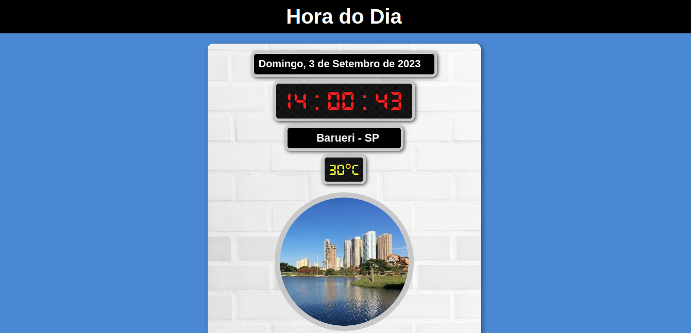

    

## 🖥️ Projeto
Este site simples foi criado para exibir a data, a hora, a localização e o clima atual de forma fácil e intuitiva.

## 🚀 Tecnologia Utilizada
O projeto foi desenvolvido utilizando a seguinte tecnologia:

- ReactJS: https://react.dev/learn